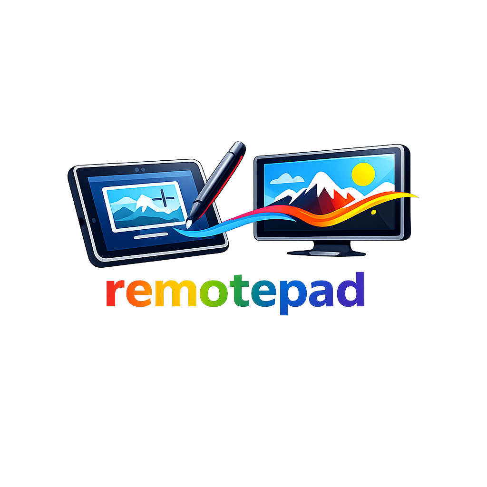
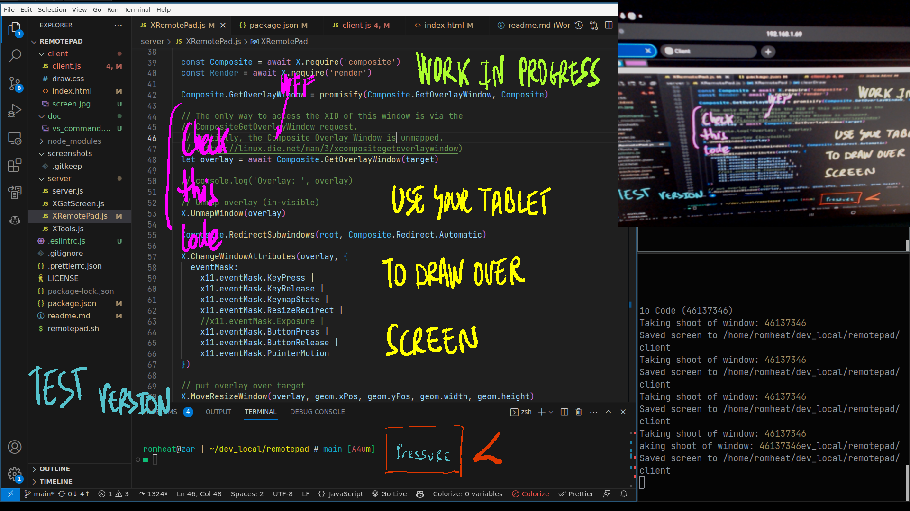
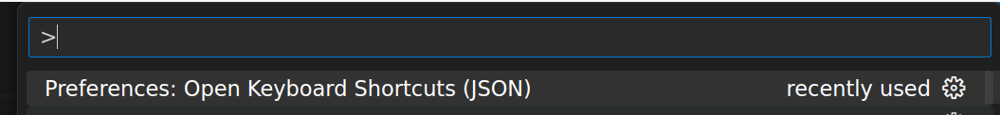

# RemotePad

Use your tablet or phone as a drawing pad for any application window on your Linux or Windows desktop.



RemotePad is a Linux/X11 (sorry wayland) and Windows tool that lets you draw over an application window from a tablet/phone browser connected on the same network.



### Features

- App input priority mode: local app remains interactive while overlay is visible
- Tablet drawing via web interface (works on iPads, Android tablets/phones)
- Screen capture with drawing overlay
- Image resizing for optimal tablet viewing
- Single-binary deployment (client files embedded at build time)
- Hotkeys for quick actions (color change, screenshot, clear, undo, quit)

## Usage

### Linux

```bash
remotepad                   # Click to select a window
remotepad current           # Use the focused window
remotepad list              # Print selectable windows
remotepad <window-id>       # Use window by X11 ID (decimal or hex)
remotepad stop              # Stop running instance
remotepad current -p 8080   # Use custom port
```

### Windows

```powershell
remotepad.exe               # Click to select a window
remotepad.exe current       # Use the foreground window
remotepad.exe list          # Print selectable windows
remotepad.exe <hwnd>        # Use window by handle (decimal or hex)
remotepad.exe stop          # Stop running instance
remotepad.exe current -p 8080  # Use custom port
```

The binary selects the window and goes to background automatically on both platforms. The server runs on port `50005` by default. Access the drawing interface from your tablet at `http://<your-ip>:50005`.

### Tablet UI

| Button | Action |
|--------|--------|
| Refresh (&#8635;) | Capture/refresh the screen from the target window |
| R / G / B dots | Switch drawing color (red, green, blue) |
| Color picker | Choose a custom drawing color |
| F / M / B | Brush size preset (fine, medium, bold) |
| Pen toggle (&#9998;) | Toggle pen-only / hand-pen mode |
| Undo (&#8617;) | Undo last stroke |
| Clear (&times;) | Clear all drawings (tap twice to confirm) |
| Screenshot (camera) | Save a screenshot to disk |
| Fullscreen (arrows) | Toggle tablet fullscreen mode |
| End (square) | End session and disable overlay |

### Hotkeys

- `CTRL+SHIFT+Q` to quit remotepad on desktop and tablet
- `CTRL+SHIFT+,` to clear screen on desktop and tablet

### Configuration

Port priority (highest to lowest):
1. `-p` command-line flag
2. `SERVER_PORT` environment variable or `.env` file
3. Default: `50005`

Optional `.env` file or environment variables:

- `SERVER_PORT=50005`


## Building

### Linux

```bash
make
```

Or with CMake:

```bash
mkdir -p build && cd build
cmake ..
make -j"$(nproc)"
```

Dependencies: X11, Xfixes, Xext, libjpeg, zlib, pthreads.

To build without embedded client files (serve from `client/` directory at runtime):

```bash
make EMBED_CLIENT=0
```

### Windows (Visual Studio 2022)

Requirements:
- Visual Studio 2022 with Desktop development with C++
- CMake (bundled with VS is fine)

```powershell
cmake --preset vs2022-x64
cmake --build --preset vs2022-x64-release
```


## VS Code Integration

Add a keyboard shortcut (e.g. CTRL+Shift+9) via Preferences > Open Keyboard Shortcuts (JSON):



```json
[{
    "key": "ctrl+shift+9",
    "command": "workbench.action.terminal.sendSequence",
    "args": { "text": "remotepad current\u000D" }
}]
```

## License

MIT License - Carlos Segura 2023-2026 s(@romheat)

The author condemns war and armed aggression, and does not support the use of this software for military aggression, war crimes, or attacks on civilians.
