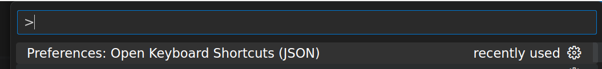

# RemotePad

Crazy idea to draw over screen using any tablet or phone :-) of course on linux

Is a client-server application that allows users to use their tablet devices to draw over their computer screen. It is designed to enhance creativity and collaboration by providing an interactive drawing experience. This documentation will guide you through the installation, setup, and usage of the program.

WORK IN PROGRESS

### Features

- Two drawing modes: Mouse Drawing Mode (local) and Tablet Drawing Mode (remote)
- Tablet Drawing Mode accessible via a web interface, compatible with various tablet devices including iPads and Android tablets/phones.
- Screen capture and drawing capabilities on captured images.
- Supports image resizing for optimal tablet viewing.

### Demo

(video here)


## Installation

For this test version

- clone this repo
- cd remotepad
- npm install
- ./remotepad.sh

## Use

```
./remotepad.sh
```

### parameters

- none - select the window to use
- current - use the current window
- <id> - use the window with id number

Application runs a server (localhost:3000) ....

- Select target window
- Server remains in background waitting for activation

  - You can access to the client from your tablet using <your-ip>:3000

- On local

  - CTRL+SHIFT+d - begins drawing mode (cursor arrow)
    - You can draw using your mouse + left button
    - mouse right button clear screen and terminate drawing mode
  - CTRL+SHIFT+e - terminate drawing mode

  - In drawing mode on your computer
    - CTRL+SHIFT+r change foreground to red
    - CTRL+SHIFT+g change foreground to green
    - CTRL+SHIFT+b change foreground to blue
    - CTRL+SHIFT+s take an screenshot of current screen
    - CTRL+SHIFT+c clear screen
    - CTRL+SHIFT+u undo

....

#### Motivation

Learn X11, use my tablet, have fun

### Tips

#### Use in Visual Studio Code

Add a keyboard shortcut I am using CTRL+Shift+9, use preferences (Open Keyboard shortcuts (JSON)) to map the desired keys. Don´t use the default



Sample

```
// Place your key bindings in this file to override the defaults
[{
    "key": "ctrl+shift+9",
    "command": "workbench.action.terminal.sendSequence",
    "args": { "text": "~/dev_local/remotepad/remotepad.sh current\u000D" }
}
]
```

### Contributing

#### TODO

- [ ] Improve client interface
- [ ] Smooth draw on X11
- [x] Stream image
- [x] Config file
- [ ] Test on different wm (I'm using i3)

#### Development

- Interested in contributing to the development of this program? Check out the GitHub repository for more details.

#### Bug Reporting

- If you find and report a bug, you're contributing too! Follow the bug reporting guidelines on the GitHub repository.

#### Feature Requests

- We welcome your ideas for new features and improvements. Share your suggestions on the GitHub repository's issue tracker.

#### Special Thanks (Related software)

I would like to express my sincere gratitude to the authors and contributors of the following open-source software packages, libraries, and tools. Without their hard work and dedication, our project would not have been possible:

- [**node-x11**](https://github.com/sidorares/node-x11): - Andrey Sidorov - X11 node.js network protocol client
- [**JIMP**](https://github.com/jimp-dev): - An image processing library written entirely in JavaScript for Node, with zero external or native dependencies
- [**socket.io**](https://github.com/socketio/socket.io): node.js eal-time bidirectional event-based communication
- [**express**](https://github.com/expressjs/express): Fast, unopinionated, minimalist web framework

### License

This program is released under the MIT License. You can find the full license text in the program repository.

### Author

Carlos Segura (@romheat)

#### Misc

- (https://w3c.github.io/pointerevents)
- node_modules/x11/lib/keysyms.js - see examples in x11 source code

#### x11 tools used

- xev - get keycodes and mouse events
- xwininfo - get info and windows id
- xprop - get window properties
